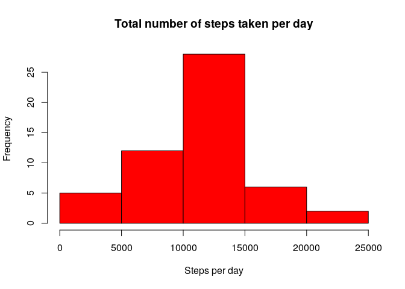
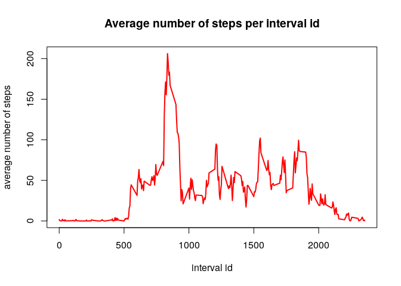
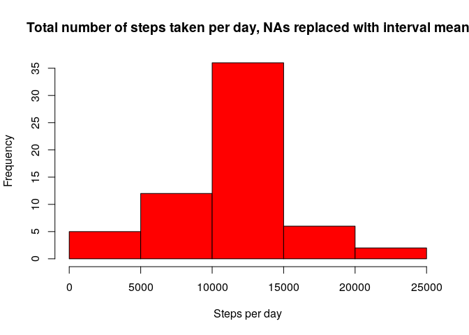
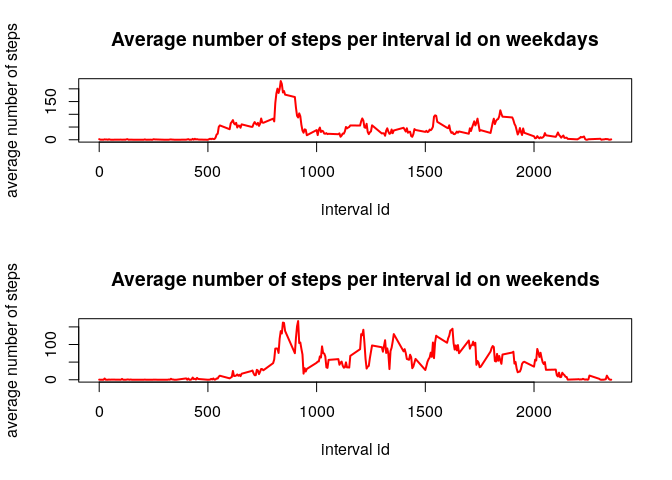

## Loading and preprocessing the data
Let us start by loading the data from the zip file. With the following code, we don't have to explicitly unzip the file in a separate step. Next, the head of the data frame will be printed.

```r
data <- read.csv(unz("activity.zip", "activity.csv")) 
head(data)
```

```
##   steps       date interval
## 1    NA 2012-10-01        0
## 2    NA 2012-10-01        5
## 3    NA 2012-10-01       10
## 4    NA 2012-10-01       15
## 5    NA 2012-10-01       20
## 6    NA 2012-10-01       25
```
## What is mean total number of steps taken per day?
First, let us compute the total number of steps taken per day.

```r
stepsperday <- aggregate(data[,1],list(data$date),sum)
head(stepsperday)
```

```
##      Group.1     x
## 1 2012-10-01    NA
## 2 2012-10-02   126
## 3 2012-10-03 11352
## 4 2012-10-04 12116
## 5 2012-10-05 13294
## 6 2012-10-06 15420
```
Next, we need a histogram of the total number of steps taken per day.

```r
hist(stepsperday$x,col="red",xlab="Steps per day",main="Total number of steps taken per day")
```

<!-- -->
   
Finally, let us compute the mean and median for the steps taken per day.

```r
cat("Mean of number of steps taken per day  : ", mean(stepsperday$x,na.rm=TRUE),"\n")
```

```
## Mean of number of steps taken per day  :  10766.19
```

```r
cat("Median of number of steps taken per day: ", median(stepsperday$x,na.rm=TRUE),"\n")
```

```
## Median of number of steps taken per day:  10765
```
## What is the average daily activity pattern?
In this section we have to generate a time series plot for the 5-minute intervals on the x-axis, and the average number of steps taken, average over all days. 

```r
stepsperint <- aggregate(data[,1],list(data$interval),mean, na.rm=TRUE)
plot(stepsperint$Group.1,stepsperint$x,type="l",col="red",lwd=2,xlab="interval id", 
     ylab="average number of steps", main="Average number of steps per interval id")
```

<!-- -->
   
Which 5-minute interval in the averaged set contains the maximum number of steps?

```r
cat("ID of 5 minute interval with max number of (average) steps: ", 
    stepsperint$Group.1[which.max(stepsperint$x)])
```

```
## ID of 5 minute interval with max number of (average) steps:  835
```
## Imputing missing values
There are missing values in the data. Let us find out how many missing values there are.

```r
cat("Number of missing values in data frame: ", sum(is.na(data)))
```

```
## Number of missing values in data frame:  2304
```
   
Let us replace the missing values with the mean of the corresponding 5-minute interval.

```r
#create a copy of data
datanew <- data
#get ids of the intervals for which step = NA
missingvalint <- data[is.na(data$steps),]$interval
#look up indices and store in vector pos
pos <- numeric()
for( i in 1:length(missingvalint)){pos[i]<-(which(stepsperint$Group.1==missingvalint[i]))}
#finally, assign the corresponding value
datanew[is.na(data$steps),]$steps <- stepsperint[pos,"x"]
head(datanew)
```

```
##       steps       date interval
## 1 1.7169811 2012-10-01        0
## 2 0.3396226 2012-10-01        5
## 3 0.1320755 2012-10-01       10
## 4 0.1509434 2012-10-01       15
## 5 0.0754717 2012-10-01       20
## 6 2.0943396 2012-10-01       25
```

We stored the data that has no NAs in the variable datanew. Let us now repeat the steps from the analysis above (histogram, mean, median), but using the data with the NAs removed this time.


```r
stepsperdaynew <- aggregate(datanew[,1],list(datanew$date),sum)
hist(stepsperdaynew$x,col="red",xlab="Steps per day",main="Total number of steps taken per day, NAs replaced with interval mean")
```

<!-- -->
   
Finally, let us compute the mean and median for the steps taken per day.

```r
cat("Mean of number of steps taken per day   (NAs replaced): ", mean(stepsperdaynew$x),"\n")
```

```
## Mean of number of steps taken per day   (NAs replaced):  10766.19
```

```r
cat("Median of number of steps taken per day (NAs replaced): ", median(stepsperdaynew$x),"\n")
```

```
## Median of number of steps taken per day (NAs replaced):  10766.19
```

It seems that the missing values only have a minor impact on the numbers. It makes sense that the mean is unaffected, since we replaced the missing values by the mean value. Because the median is very close to the mean, there is also no significant effect on the median as well.

## Are there differences in activity patterns between weekdays and weekends?
Let us now add a factors that encodes whether a certain date was a weekday or a weekend.

```r
datanew <- cbind(datanew,with(datanew,ifelse(weekdays(as.Date(data$date))!="Saturday" & 
                                             weekdays(as.Date(data$date))!="Sunday","weekday","weekend")))
colnames(datanew) <- c("steps","date","interval","day_of_week")
head(datanew)
```

```
##       steps       date interval day_of_week
## 1 1.7169811 2012-10-01        0     weekday
## 2 0.3396226 2012-10-01        5     weekday
## 3 0.1320755 2012-10-01       10     weekday
## 4 0.1509434 2012-10-01       15     weekday
## 5 0.0754717 2012-10-01       20     weekday
## 6 2.0943396 2012-10-01       25     weekday
```

Now that we can distinguish between weekdays and weekends, let us compute the interval averages.

```r
weekdays <- datanew[datanew$day_of_week == "weekday",]
weekends <- datanew[datanew$day_of_week == "weekend",]
avgstepswd <- aggregate(weekdays[,1],list(weekdays$interval),mean)
avgstepswe <- aggregate(weekends[,1],list(weekends$interval),mean)
par(mfrow=c(2,1))

plot(avgstepswd$Group.1,avgstepswd$x,type="l",col="red",lwd=2,xlab="interval id", 
     ylab="average number of steps", main="Average number of steps per interval id on weekdays")
plot(avgstepswe$Group.1,avgstepswe$x,type="l",col="red",lwd=2,xlab="interval id", 
     ylab="average number of steps", main="Average number of steps per interval id on weekends")
```

<!-- -->
